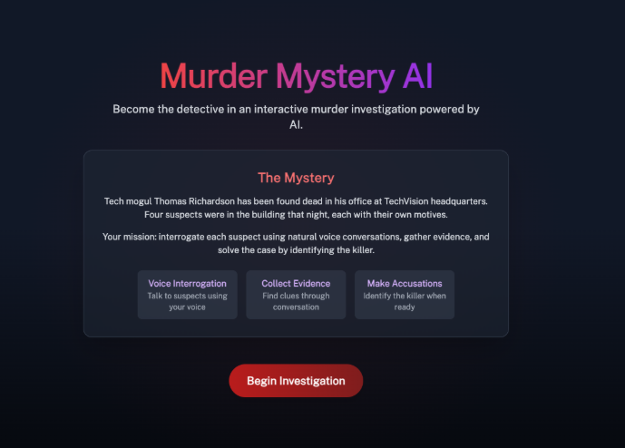

# Murder Mystery AI



An interactive murder mystery game where you interrogate AI suspects using your voice and solve the case by finding the real culprit. Wanted to try out voice agents as well as test cursor's (AI IDE) capeabilities :)

## Features

- **Voice-Powered Interrogation**: Natural voice conversations with AI suspects
- **Dynamic Characters**: Multiple suspects with unique personalities, backgrounds, and secrets
- **Accusation System**: Make accusations when you think you've solved the case
- **Responsive UI**: Clean, modern interface that works on desktop and mobile

## Tech Stack

- **Frontend**: Next.js, TypeScript, Tailwind CSS
- **Voice Interface**: LiveKit SDK for real-time audio
- **AI Backend**: Python-based agent using OpenAI, Deepgram, and Cartesia
- **Speech Technologies**: Speech-to-text, text-to-speech, voice activity detection


### Prerequisites

- Node.js (18.x or higher)
- Python (3.9 or higher)
- pnpm (recommended) or npm
- API keys for:
  - LiveKit
  - OpenAI
  - Deepgram
  - Cartesia

### Frontend Setup

1. Navigate to the frontend directory:

```bash
cd frontend
```

2. Install dependencies:

```bash
pnpm install
# or
npm install
```

3. Create a `.env.local` file with your LiveKit credentials:

```
LIVEKIT_API_KEY="your_livekit_api_key"
LIVEKIT_API_SECRET="your_livekit_api_secret"
LIVEKIT_URL="your_livekit_url"
```

4. Start the development server:

```bash
pnpm dev
# or
npm run dev
```

The frontend will be available at http://localhost:3000

### Agent Setup

1. Navigate to the agent directory:

```bash
cd agent
```

2. Create a Python virtual environment:

```bash
# For macOS/Linux
python3 -m venv venv
source venv/bin/activate

# For Windows
python -m venv venv
venv\Scripts\activate
```

3. Install Python dependencies:

```bash
pip install -r requirements.txt
```

4. Download required model files (important):

```bash
python3 agent.py download-files
```

5. Create a `.env.local` file with your API credentials:

```
CARTESIA_API_KEY="your_cartesia_api_key"
DEEPGRAM_API_KEY="your_deepgram_api_key"
LIVEKIT_API_KEY="your_livekit_api_key"
LIVEKIT_API_SECRET="your_livekit_api_secret"
LIVEKIT_URL="your_livekit_url"
OPENAI_API_KEY="your_openai_api_key"
```

6. Start the agent:

```bash
# For development with auto-reload
python3 agent.py dev

# For production
python3 agent.py start
```
